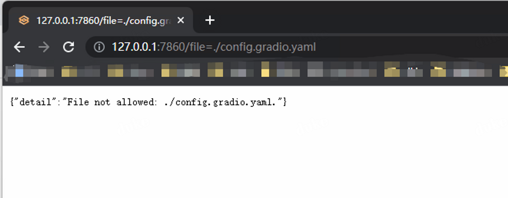
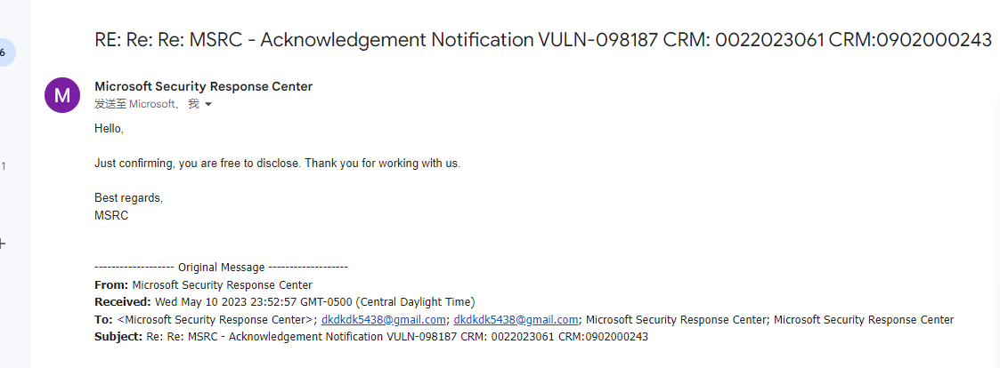

# microsoft/JARVIS has a sensitive information disclosure vulnerability

Recently I reported a Sensitive information leakage vulnerability to the MSRC. As a final response, I received the following:

> Yes, we have confirmed the activity that you have reported, and we have shared it with the appropriate team to implement a fix. Since this does not pose an immediate threat that requires urgent attention, we have closed this case.
> 

There's a couple things here:

- While I know that information leakage would probably be rated as moderately severe in terms of security, I think it is a critical issue as far as user security is concerned (and because it is so easy to trigger).
- as I won't receive further updates from the MSRC, I'm opening this issue, so that I can at least get notified once it's been resolved

### Impact

This vulnerability affects all versions of microsoft/JARVIS to date, and there is a sensitive information leakage vulnerability. This security vulnerability will expose configuration files, source code, and other information deployed in public networks, including users' Open AI Keys. As of now, through asset mapping detection, more than 1,100 personal users or commercial products have deployed microsoft/JARVIS assets exposed to the Internet, which may be at risk.

### **Patches & Workarounds**

~~As of now, there is no official update and fix. It is recommended that users delete the Open AI Key and huggingface Token in config.gradio.yaml, and use environment variables for use, waiting for official upgrades in the future.~~

Gradio has added a file blacklist feature in the latest version v3.32.0. The related fix code demo is as follows. 
```python
import gradio as gr

def greet(name):
    return "Hello " + name + "!"

with gr.Blocks() as demo:
    name = gr.Textbox(label="Name")
    output = gr.Textbox(label="Output Box")
    greet_btn = gr.Button("Greet")
    greet_btn.click(fn=greet, inputs=name, outputs=output)

if __name__ == "__main__":
    demo.launch(blocked_paths=["config.py","config.gradio.yaml"])
```



### References

Due to JARVIS mistakenly using the gradio Web framework, sensitive information was placed in the cwd directory. Since gradio has a route/file that can read any file in the cwd directory, it leads to sensitive information leakage. 

poc：

(Microsoft JARVIS Demo)

[https://microsoft-hugginggpt.hf.space/file=./app.py](https://microsoft-hugginggpt.hf.space/file=./app.py)

[https://microsoft-hugginggpt.hf.space/file=./config.gradio.yaml](https://microsoft-hugginggpt.hf.space/file=./config.gradio.yaml)

(location Demo)

[http://location:8080/file=./app.py](http://location:8080/file=./app.py)

[http://location:8080/file=./config.gradio.yaml](http://location:8080/file=./config.gradio.yaml)

## Timeline

| Date       | Description                                                                                                                        |
|------------|------------------------------------------------------------------------------------------------------------------------------------|
| 18.04.2023 | SIX reported issue. |
| 19.04.2023 | Microsoft changed issue status from *New* to *Review / Repro*. |
| 03.05.2023 | Microsoft closed case. *"MSRC has investigated this issue and concluded that this does not pose an immediate threat that requires urgent attention due to low impact."* |
| 11.05.2023 | Microsoft changed issue status from *Complete - Resolved* to *Review / Repro*. |
| 11.05.2023 | Public disclosure of vulnerability. |


